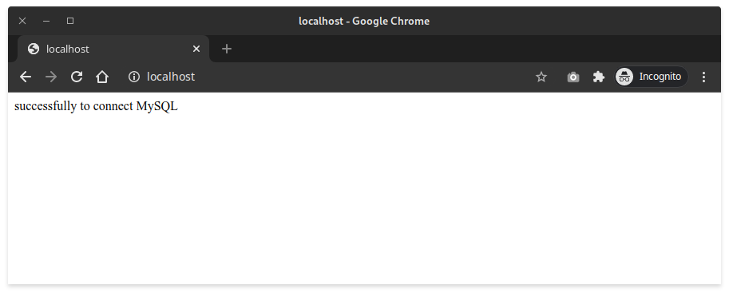
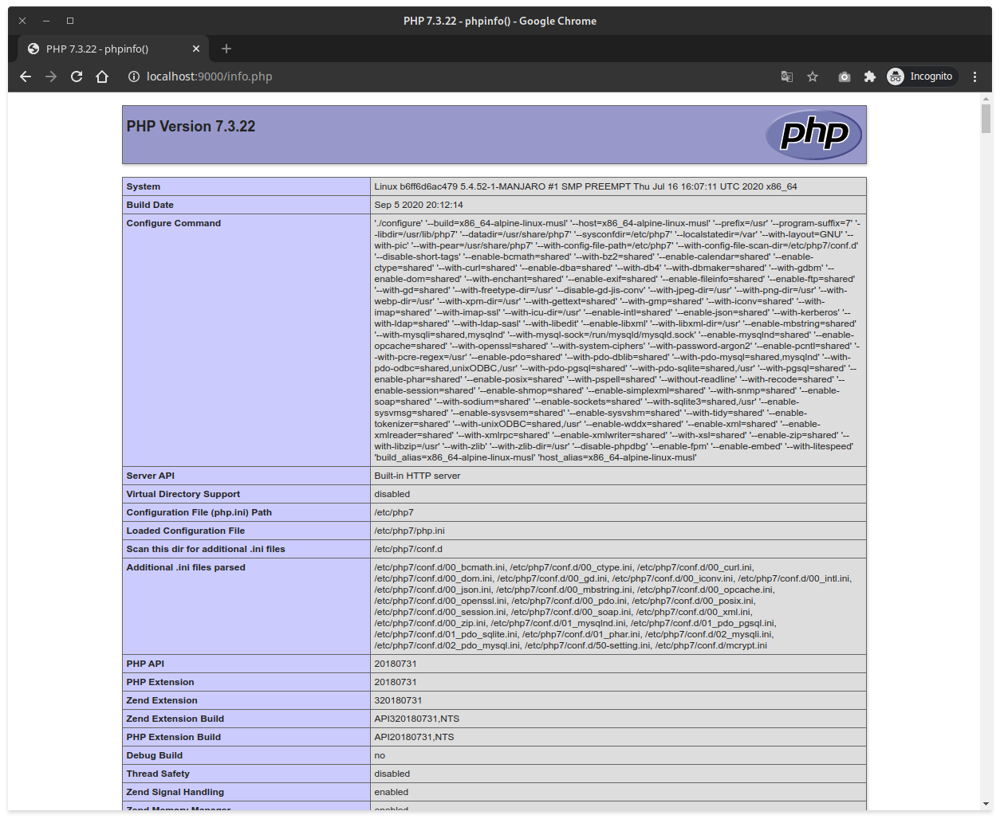

# PHP-FPM, NGINX AND MYSQL FOR IDN INFRASTRUCTURE ENGINEER TEST PROJECT
## Folder Structure
```
.
├── data
│   └── db
│       └── mysql
│           ├── auto.cnf
│           ├── ca-key.pem
│           ├── etc
├── .docker
│   ├── conf
│   │   ├── mysql
│   │   │   └── gatewaymy.cnf
│   │   ├── nginx
│   │   │   └── default.conf
│   │   └── php
│   │       ├── php-fpm.conf
│   │       ├── php.ini
│   │       └── xdebug.ini
│   └── Dockerfile
├── docker-compose.yaml
├── .env
├── README.md
└── web
    ├── index.php
    └── info.php

```

- `.docker/conf`
> Folder configuration for mysql, nginx and php.
- `.docker/Dockerfile`
> In this project Dockerfile is containing blueprint of our php module and other system requirement depedency based on alpine 3.11 operating system.
- `docker-compose.yaml`
> With docker-compose our project can be run services of php, nginx and mysql together with a single command
- `.env`
> Containing environment for our services if you changes mysql version or other information like username anda password.
- `web`
> You can put php project ini this folder
- `data`
> after running docker-compose this folder will be generated and containing several file and folder for our mysql data

## How to run
1. start
```bash
┌─[±][main S:1 U:1 ✗][idn_test][]
└─▪ docker-compose up --build
Creating network "idn_test_default" with the default driver
Building php
Step 1/9 : FROM alpine:3.11
 ---> f70734b6a266
Step 2/9 : RUN apk --update add curl git unzip
 ---> Using cache
 ---> 27fb82c0bac5
Step 3/9 : RUN echo "https://dl.bintray.com/php-alpine/v3.11/php-7.3" >> /etc/apk/repositories
 ---> Using cache
 ---> 8012268d924a
Step 4/9 : RUN apk --update add         php7         php7-bcmath         php7-dom         php7-ctype         php7-curl         php7-fpm         php7-gd         php7-iconv         php7-intl         php7-json         php7-mbstring         php7-mcrypt         php7-mysqlnd         php7-opcache         php7-openssl         php7-pdo         php7-mysqli         php7-pdo_mysql         php7-pdo_pgsql         php7-pdo_sqlite         php7-phar         php7-posix         php7-session         php7-soap         php7-xml         php7-zip     && rm -rf /var/cache/apk/*
 ---> Using cache
 ---> c1c9eea0c01d
Step 5/9 : WORKDIR /application
 ---> Using cache
 ---> a8ea519d9de3
Step 6/9 : RUN curl -sS https://getcomposer.org/installer | php -- --install-dir=/usr/bin --filename=composer
 ---> Using cache
 ---> 8c64a780f5c0
Step 7/9 : RUN sed -i -e 's/listen = 127.0.0.1:9000/listen = 0.0.0.0:9000/g' /etc/php7/php-fpm.d/www.conf
 ---> Using cache
 ---> 243e43a94d09
Step 8/9 : EXPOSE 9000
 ---> Using cache
 ---> aeff3a266fb4
Step 9/9 : CMD ["php", "-S", "0.0.0.0:9000", "-t", "."]
 ---> Using cache
 ---> 4263a8f6b3db
Successfully built 4263a8f6b3db
Successfully tagged idn_test_php:latest
Creating mysql ... done
Creating idn_test_php_1 ... done
Creating idn_test_web_1 ... done
Attaching to mysql, idn_test_php_1, idn_test_web_1
php_1      | PHP 7.3.22 Development Server started at Sat Oct  3 07:13:27 2020
mysql      | 2020-10-03 07:13:26+00:00 [Note] [Entrypoint]: Entrypoint script for MySQL Server 5.7 started.
web_1      | /docker-entrypoint.sh: /docker-entrypoint.d/ is not empty, will attempt to perform configuration
web_1      | /docker-entrypoint.sh: Looking for shell scripts in /docker-entrypoint.d/
mysql      | 2020-10-03 07:13:26+00:00 [Note] [Entrypoint]: Switching to dedicated user 'mysql'
web_1      | /docker-entrypoint.sh: Launching /docker-entrypoint.d/10-listen-on-ipv6-by-default.sh
mysql      | 2020-10-03 07:13:26+00:00 [Note] [Entrypoint]: Entrypoint script for MySQL Server 5.7 started.
mysql      | 2020-10-03T07:13:26.756754Z 0 [Warning] TIMESTAMP with implicit DEFAULT value is deprecated. Please use --explicit_defaults_for_timestamp server option (see documentation for more details).
mysql      | 2020-10-03T07:13:26.758826Z 0 [Note] mysqld (mysqld 5.7.31) starting as process 1 ...
mysql      | 2020-10-03T07:13:26.763249Z 0 [Note] InnoDB: PUNCH HOLE support available
mysql      | 2020-10-03T07:13:26.763279Z 0 [Note] InnoDB: Mutexes and rw_locks use GCC atomic builtins
mysql      | 2020-10-03T07:13:26.763284Z 0 [Note] InnoDB: Uses event mutexes
mysql      | 2020-10-03T07:13:26.763289Z 0 [Note] InnoDB: GCC builtin __atomic_thread_fence() is used for memory barrier
mysql      | 2020-10-03T07:13:26.763294Z 0 [Note] InnoDB: Compressed tables use zlib 1.2.11
mysql      | 2020-10-03T07:13:26.763298Z 0 [Note] InnoDB: Using Linux native AIO
web_1      | 10-listen-on-ipv6-by-default.sh: Getting the checksum of /etc/nginx/conf.d/default.conf
mysql      | 2020-10-03T07:13:26.763639Z 0 [Note] InnoDB: Number of pools: 1
mysql      | 2020-10-03T07:13:26.763777Z 0 [Note] InnoDB: Using CPU crc32 instructions
mysql      | 2020-10-03T07:13:26.765792Z 0 [Note] InnoDB: Initializing buffer pool, total size = 128M, instances = 1, chunk size = 128M
web_1      | 10-listen-on-ipv6-by-default.sh: error: /etc/nginx/conf.d/default.conf differs from the packaged version
web_1      | /docker-entrypoint.sh: Launching /docker-entrypoint.d/20-envsubst-on-templates.sh
mysql      | 2020-10-03T07:13:26.777483Z 0 [Note] InnoDB: Completed initialization of buffer pool
mysql      | 2020-10-03T07:13:26.779808Z 0 [Note] InnoDB: If the mysqld execution user is authorized, page cleaner thread priority can be changed. See the man page of setpriority().
mysql      | 2020-10-03T07:13:26.791325Z 0 [Note] InnoDB: Highest supported file format is Barracuda.
mysql      | 2020-10-03T07:13:26.797994Z 0 [Note] InnoDB: Creating shared tablespace for temporary tables
mysql      | 2020-10-03T07:13:26.798094Z 0 [Note] InnoDB: Setting file './ibtmp1' size to 12 MB. Physically writing the file full; Please wait ...
mysql      | 2020-10-03T07:13:26.824532Z 0 [Note] InnoDB: File './ibtmp1' size is now 12 MB.
mysql      | 2020-10-03T07:13:26.825220Z 0 [Note] InnoDB: 96 redo rollback segment(s) found. 96 redo rollback segment(s) are active.
mysql      | 2020-10-03T07:13:26.825231Z 0 [Note] InnoDB: 32 non-redo rollback segment(s) are active.
mysql      | 2020-10-03T07:13:26.825638Z 0 [Note] InnoDB: 5.7.31 started; log sequence number 12578224
mysql      | 2020-10-03T07:13:26.825782Z 0 [Note] InnoDB: Loading buffer pool(s) from /var/lib/mysql/ib_buffer_pool
mysql      | 2020-10-03T07:13:26.825996Z 0 [Note] Plugin 'FEDERATED' is disabled.
mysql      | 2020-10-03T07:13:26.828358Z 0 [Note] InnoDB: Buffer pool(s) load completed at 201003  7:13:26
mysql      | 2020-10-03T07:13:26.832048Z 0 [Note] Found ca.pem, server-cert.pem and server-key.pem in data directory. Trying to enable SSL support using them.
mysql      | 2020-10-03T07:13:26.832067Z 0 [Note] Skipping generation of SSL certificates as certificate files are present in data directory.
mysql      | 2020-10-03T07:13:26.832760Z 0 [Warning] CA certificate ca.pem is self signed.
mysql      | 2020-10-03T07:13:26.832792Z 0 [Note] Skipping generation of RSA key pair as key files are present in data directory.
mysql      | 2020-10-03T07:13:26.833256Z 0 [Note] Server hostname (bind-address): '*'; port: 3306
mysql      | 2020-10-03T07:13:26.833308Z 0 [Note] IPv6 is available.
mysql      | 2020-10-03T07:13:26.833322Z 0 [Note]   - '::' resolves to '::';
mysql      | 2020-10-03T07:13:26.833343Z 0 [Note] Server socket created on IP: '::'.
mysql      | 2020-10-03T07:13:26.834723Z 0 [Warning] Insecure configuration for --pid-file: Location '/var/run/mysqld' in the path is accessible to all OS users. Consider choosing a different directory.
mysql      | 2020-10-03T07:13:26.842418Z 0 [Note] Event Scheduler: Loaded 0 events
mysql      | 2020-10-03T07:13:26.842619Z 0 [Note] mysqld: ready for connections.
mysql      | Version: '5.7.31'  socket: '/var/run/mysqld/mysqld.sock'  port: 3306  MySQL Community Server (GPL)
web_1      | /docker-entrypoint.sh: Configuration complete; ready for start up


```
or

```bash
┌─[±][main S:1 U:1 ✗][idn_test][]
└─▪ docker-compose up -d --build
Building php
Step 1/9 : FROM alpine:3.11
 ---> f70734b6a266
Step 2/9 : RUN apk --update add curl git unzip
 ---> Using cache
 ---> 27fb82c0bac5
Step 3/9 : RUN echo "https://dl.bintray.com/php-alpine/v3.11/php-7.3" >> /etc/apk/repositories
 ---> Using cache
 ---> 8012268d924a
Step 4/9 : RUN apk --update add         php7         php7-bcmath         php7-dom         php7-ctype         php7-curl         php7-fpm         php7-gd         php7-iconv         php7-intl         php7-json         php7-mbstring         php7-mcrypt         php7-mysqlnd         php7-opcache         php7-openssl         php7-pdo         php7-mysqli         php7-pdo_mysql         php7-pdo_pgsql         php7-pdo_sqlite         php7-phar         php7-posix         php7-session         php7-soap         php7-xml         php7-zip     && rm -rf /var/cache/apk/*
 ---> Using cache
 ---> c1c9eea0c01d
Step 5/9 : WORKDIR /application
 ---> Using cache
 ---> a8ea519d9de3
Step 6/9 : RUN curl -sS https://getcomposer.org/installer | php -- --install-dir=/usr/bin --filename=composer
 ---> Using cache
 ---> 8c64a780f5c0
Step 7/9 : RUN sed -i -e 's/listen = 127.0.0.1:9000/listen = 0.0.0.0:9000/g' /etc/php7/php-fpm.d/www.conf
 ---> Using cache
 ---> 243e43a94d09
Step 8/9 : EXPOSE 9000
 ---> Using cache
 ---> aeff3a266fb4
Step 9/9 : CMD ["php", "-S", "0.0.0.0:9000", "-t", "."]
 ---> Using cache
 ---> 4263a8f6b3db
Successfully built 4263a8f6b3db
Successfully tagged idn_test_php:latest
Starting mysql ... done
Starting idn_test_php_1 ... done
Starting idn_test_web_1 ... done
┌─[±][main S:1 U:1 ✗][idn_test][]
└─▪ 

````

to running on the background

2. show the docker images
```
idn_test_php                                         latest              4263a8f6b3db        5 hours ago         87MB
nginx                                                latest              7e4d58f0e5f3        3 weeks ago         133MB
mysql                                                5.7                 ef08065b0a30        3 weeks ago         448MB
alpine                                               3.11                f70734b6a266        5 months ago        5.61MB
```
3. proses monitoring
```bash
┌─[±][main S:1 U:1 ✗][idn_test][]
└─▪ docker-compose ps
     Name                   Command               State                 Ports              
-------------------------------------------------------------------------------------------
idn_test_php_1   php -S 0.0.0.0:9000 -t .         Up      9000/tcp           
idn_test_web_1   /docker-entrypoint.sh ngin ...   Up      0.0.0.0:80->80/tcp               
mysql            docker-entrypoint.sh mysqld      Up      0.0.0.0:8989->3306/tcp, 33060/tcp

```
4. acces the web
- an example php script for connecting php to mysql database

- show the information of installed php version

5. show logs of our service
```bash
┌─[±][main S:1 U:1 ✗][idn_test][]
└─▪ docker-compose logs -f php  
Attaching to idn_test_php_1
php_1      | PHP 7.3.22 Development Server started at Sat Oct  3 07:13:27 2020
php_1      | PHP 7.3.22 Development Server started at Sat Oct  3 07:14:02 2020
php_1      | [Sat Oct  3 07:15:16 2020] 172.20.0.4:51590 [200]: /
php_1      | [Sat Oct  3 07:15:18 2020] 172.20.0.4:51594 [200]: /
php_1      | [Sat Oct  3 07:15:18 2020] 172.20.0.4:51598 [200]: /

```

6. stop

```bash
┌─[±][main S:1 U:1 ✗][idn_test][]
└─▪ docker-compose down
Stopping mysql          ... done
Stopping idn_test_web_1 ... done
Stopping idn_test_php_1 ... done
Removing mysql          ... done
Removing idn_test_web_1 ... done
Removing idn_test_php_1 ... done
Removing network idn_test_default
````